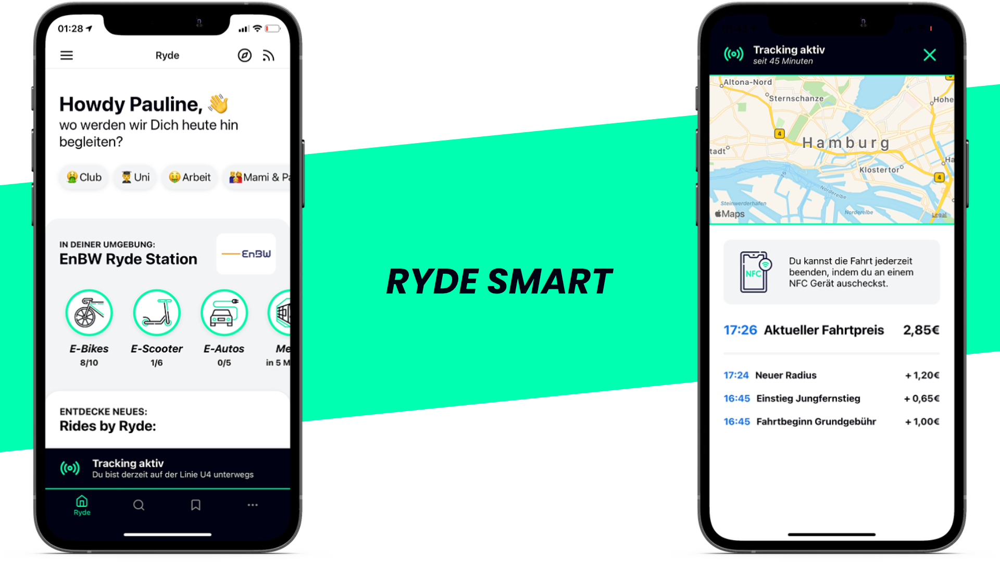

## Team: E06 Challenge: Environmental

# RYDE - The smart commute
Titel & Slogan der Solution

# Über das Projekt
Wie pendeln wir morgen? Ryde ist die Antwort. Ryde bündelt alle Verkehrsmöglichkeiten einer Stadt in einer App und ermöglicht kontaktloses Ein und Aussteigen sowie nahtlose Übergänge zu anderen Verkehrsmitteln. 

### ✨ Kontaktloses Bezahlen 
Ryde macht das Pendeln und Reisen entspannter und einfacher. Mit NFC CheckIn und CheckOut Points an Haltestellen, in Bus und Bahn und auf den EBikes etc. registriert die App den Einstieg und berechnet beim Ausstieg im Hintergrund den besten Preis für den Fahrgast. Gleichzeitig gibt es für Pendler ein einfaches Abo Model, was unbegrenzte Verkehrsmöglichkeiten zu jeder Uhrzeit ermöglicht. 

### 🔋 Ryde Stations by EnBW
Ein wichtiger Bestandteil der nahtlosen Übergänge sind die Ryde Stations powered by EnBW, die an Verkehrsknotenpunkten in den Städten (Hauptbahnhof etc.) schnelle Umsteige- und Fahrt-Möglichkeiten anbieten. Mit EnBW HyperNetz Schnellladern sind alle Fortbewegungsmittel jederzeit 100% Einsatzbereit an den Ryde Stations und ermöglichen somit nahtlose Weiterfahrten. 

### 📊 Transportation wird Realtime
Mit Ryde App Nutzerdaten Analysen und Sammlungen, können Unternehmen und Verkehrsbetriebe Realtime Daten zu ihren Strecken einsehen und analysieren. Das ermöglicht schnelles reagieren auf Verkehrveränderungen. 

### 🍀 Faktor Umwelt
Durch Ryde werden alle Möglichkeiten gebündelt und das Reisen entspannter. So werden mehr Pendler von der Straße auf Ryde umsteigen und alle Vorteile genießen. Dadurch wird die Umwelt deutlich geschont. Alle Fortbewegungsmöglichkeiten, uanbhängig von Bus und Bahn, sind E-Mobility Lösungen, die 100% elektrisch fahren und an den Ryde Stations durch die EnBW HyperNetz Schnellladern immer zu 100% Startklar sind.


### 📱 Unsere App



# 🍻 Teammitglieder
- Benedikt Kupfer
- Caspar Gossmann
- Jonas Buschbacher
- Julian Ortlieb
- Patrick Egen

# Get the App
## Self Installation 
Ryde is build with Expo and React-Native as a Cross Plattform Application for Android and iOS. 

### 1. Install the Expo CLI 

```sh
npm install --global expo-cli
```
### 2. Install Dependencies 
 
```sh
npm i
```

### 3. Start the Dev. Server

```sh
expo start 
```
### 4. Download the Expo Go App
Download the Expo Go App and Scan the QR Code with your Smartphone Camera
[Expo Go for Android Devices](https://play.google.com/store/apps/details?id=host.exp.exponent&hl=de)
[Expo Go for iOS Devices](https://apps.apple.com/de/app/expo-client/id982107779)
